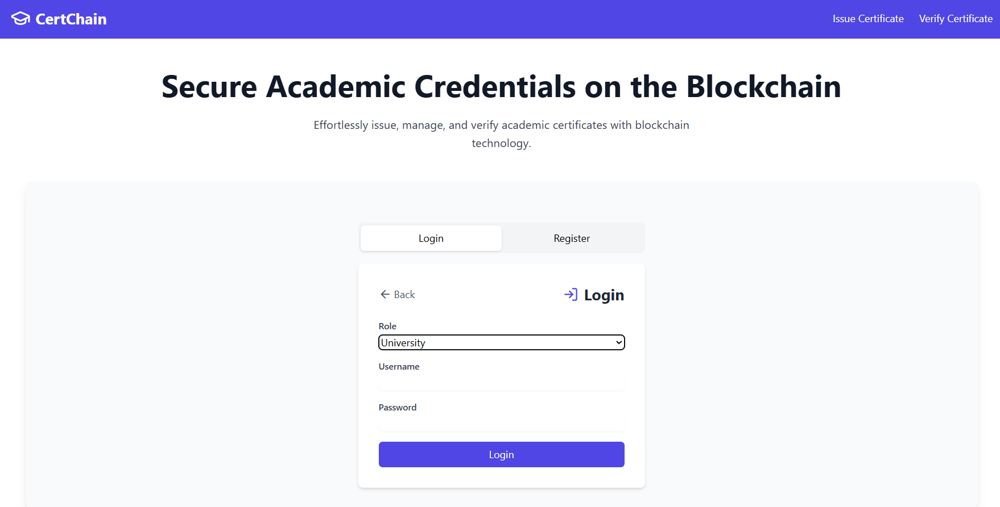

# Blockchain-Based Academic Credentials Issuance System

## Overview

This project is a blockchain-powered academic credentials issuance platform designed to simplify and secure the process of certificate issuance and verification. Built using Ethers.js for blockchain integration and Twilio for OTP-based authentication, the system allows multiple universities to issue tamper-proof digital certificates to students, who can download them securely.

---

## Key Features

- OTP-based authentication (Twilio)
- Multi-role access: Student, University, Verifier
- Certificate upload and verification
- Blockchain-backed issuance with Ethers.js
- Dashboards for real-time credential visibility
- Bulk student upload and verification
- Built with React + TypeScript + Node.js

---

## Tech Stack

| Layer        | Tools                                |
|--------------|---------------------------------------|
| Frontend     | React, TypeScript, Tailwind CSS       |
| Backend      | Node.js, Express                      |
| Blockchain   | Ethers.js, Smart Contracts (Ethereum) |
| Auth         | Twilio OTP                            |
| File Handling| Context API, PDF + image support      |

---

## Output Screenshots

### Login & Registration  

 
 
 

---

### Student Flow  

- **Student Registration**
  
  
  
- **Student Login**
  
  

- **Student Dashboard**
  
  

- **Sample Student Data**
  
  

---

### University Flow  
- **University Registration**
  
  

- **University Login**
  
  

- **University Dashboards**
  
  

  
  
  


---

### Verifier Flow  
- **Verifier Registration**
  
  

- **Verifier Login**
  
  

- **Verifier Dashboard**
  
  

---

## How to Run the Project

### Prerequisites
- Node.js and npm installed
- `dotenv` installed globally (`npm install -g dotenv-cli`) or use with `npx`

---

### Backend Setup

```bash
cd backend
dotenv -e .env -- node server.js
```

> This starts the backend on port `5176`.

#### Sample `.env` File (backend/.env)

```
TWILIO_SID=your_twilio_sid
TWILIO_AUTH_TOKEN=your_twilio_auth_token
TWILIO_PHONE_NUMBER=your_twilio_phone_number
PORT=5176
```
---
### Frontend Setup

```bash
cd frontend
npm run dev
```

> This starts the frontend on port `5174`.

## Contact

**Ashrith Sambaraju**  
  Email: ashrithsambaraju@gmail.com  
  LinkedIn: [linkedin.com/in/ashrith-sambaraju](https://www.linkedin.com/in/ashrith-sambaraju)


